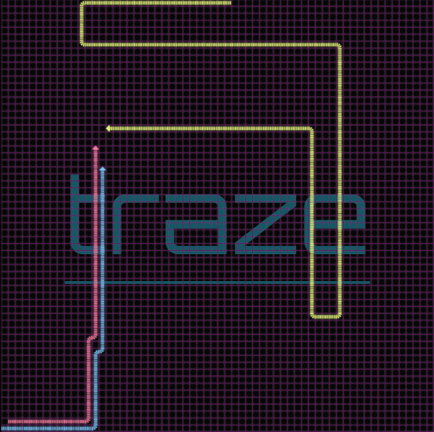

# Traze and Snake with Spiking Neural Networks
Bots for [Traze](/traze-client) and [Snake](/Snake) using Spiking Neural Networks.

The code is partially based on [this repo](https://github.com/YuriyGuts/snake-ai-reinforcement) and developed by Henrique Orefice and Alexander Abstreiter.

## Traze

Traze is a multiplayer deathmatch game developed by iteratec. Repository with server and different clients: www.github.com/iteratec/traze

## Snake
This project includes the well known Snake in 2D as well as a version in 1D.